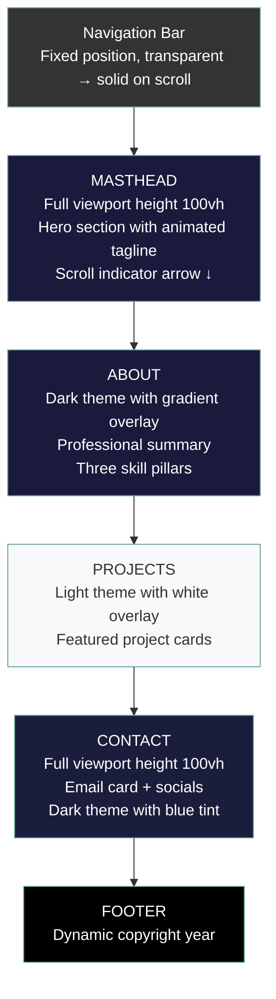
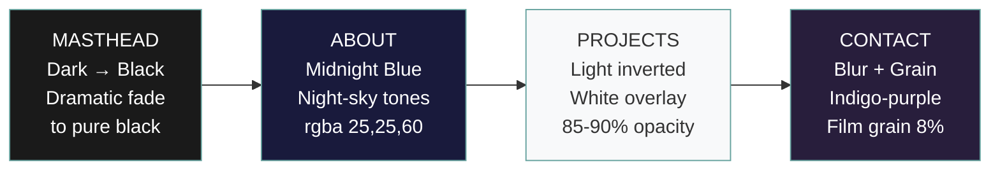

# wclaytor.github.io

Personal portfolio and project showcase website for William Claytor, Senior Software Engineer with 25 years of industry experience in software development, quality assurance, and test automation.

🌐 **[Live Site](https://wclaytor.github.io/)**

---

## Site Design & Architecture

### Design Philosophy

This portfolio follows a **single-page application** design pattern using a scrolling section layout. Each major section (Masthead, About, Projects, Contact) is designed to feel like a complete "page" when navigated to via the sticky navigation bar, while maintaining the ability to smoothly scroll through the entire experience.

**Core Principles:**
- 🎯 **Professional First** - Clean design that instills confidence
- 🎨 **Modern & Fresh** - Contemporary aesthetics with subtle animations
- ♿ **Universal Compatibility** - Accessible, responsive, cross-browser
- 🔧 **Easy Maintenance** - Modular architecture with reusable patterns

### Page Layout Structure

The homepage consists of four full-screen sections stacked vertically:



---

## Background Image Theming System

### The Unified Background Approach

One of the distinctive design features of this portfolio is its **unified background image theming system**. A single hero image (`assets/img/bg-masthead.jpg`) is used across all sections, but with different CSS gradient overlays that completely transform its appearance for each section's purpose.

This technique:
- ✅ Reduces HTTP requests (one image vs. multiple)
- ✅ Creates visual cohesion throughout the site
- ✅ Enables smooth transitions between sections
- ✅ Maintains consistent "feel" while varying mood

### Gradient Filter Recipes

Each section applies a unique `linear-gradient` overlay that filters the same background image:

#### Masthead (Hero Section)
```css
.masthead {
  background: linear-gradient(
    to bottom,
    rgba(0, 0, 0, 0.3) 0%,      /* Light at top */
    rgba(0, 0, 0, 0.7) 75%,     /* Darkens toward bottom */
    #000 100%                    /* Solid black at bottom edge */
  ), url("../assets/img/bg-masthead.jpg");
}
```
**Effect:** Dark, dramatic hero with gradient fade to pure black (seamless transition to About)

#### About Section
```css
.about-section {
  background: linear-gradient(
    135deg,
    rgba(25, 25, 60, 0.80) 0%,     /* Dark midnight blue */
    rgba(15, 30, 60, 0.85) 50%,    /* Deeper navy */
    rgba(0, 0, 0, 0.95) 100%       /* Black */
  ), url("../assets/img/bg-masthead.jpg");
}
```
**Effect:** Sophisticated midnight blue atmosphere with night-sky tones, maintains visual flow from Masthead

#### Projects Section
```css
.projects-section {
  background: linear-gradient(
    to bottom,
    rgba(255, 255, 255, 0.85) 0%,   /* Heavy white overlay */
    rgba(255, 255, 255, 0.75) 75%,  /* Slightly less opaque */
    rgba(248, 249, 250, 0.9) 100%   /* Light gray at bottom */
  ), url("../assets/img/bg-masthead.jpg");
}
```
**Effect:** Bright, light section—same image appears completely different through white filter

#### Contact Section
```css
.contact-section::before {
  background: linear-gradient(
    160deg,
    rgba(20, 30, 60, 0.75) 0%,     /* Deep indigo-blue */
    rgba(40, 20, 60, 0.70) 30%,    /* Subtle purple */
    rgba(15, 25, 50, 0.80) 70%,    /* Dark blue */
    rgba(0, 0, 0, 0.95) 100%       /* Black */
  ), url("../assets/img/bg-masthead.jpg");
  filter: blur(3px);
}

.contact-section::after {
  /* Film grain overlay using SVG noise pattern */
  background-image: url("data:image/svg+xml,...");
  opacity: 0.08;
}
```
**Effect:** Premium presentation with blurred background, cinematic film grain texture, and indigo-purple gradient for distinction while maintaining cohesion

### Visual Flow



---

## UI Components & Animations

### Masthead Tagline
The "Senior Software Engineer" tagline features a subtle entrance animation:

```css
.masthead-tagline {
  font-size: 1.25rem;
  letter-spacing: 0.15rem;
  color: rgba(255, 255, 255, 0.7);
  animation: fadeIn 1.5s ease-in;
}

@keyframes fadeIn {
  from { opacity: 0; transform: translateY(10px); }
  to { opacity: 1; transform: translateY(0); }
}
```

### Scroll Indicator
A subtle bouncing arrow encourages users to scroll, appearing after the masthead loads:

```css
.scroll-indicator {
  animation: fadeInDelayed 1s ease-out 2s both;
}

.scroll-indicator .arrow {
  animation: bounceSubtle 2s ease-in-out infinite;
}

@keyframes bounceSubtle {
  0%, 100% { transform: translateY(0); }
  50% { transform: translateY(5px); }
}
```
- Appears after 2-second delay
- Auto-hides when user scrolls past 100px
- Click/tap scrolls smoothly to About section

### Full-Page Sections
The Contact section uses viewport height to create a "page" feel:

```css
.contact-section {
  min-height: 100vh;
  display: flex;
  flex-direction: column;
  justify-content: center;
}
```

### SVG Icon System
Custom inline SVGs replace Font Awesome for performance (~130KB savings):

```css
.icon { width: 24px; height: 24px; }
.icon-sm { width: 16px; height: 16px; }
.icon-lg { width: 32px; height: 32px; }
.icon-xl { width: 48px; height: 48px; }
```

---

## Featured Projects

### Alpine Resume
A modern, interactive resume Progressive Web App built with Alpine.js. Transforms a traditional Markdown-formatted resume into a beautiful, interactive PWA that works offline and installs as a native app.

**Features:**
- 📱 Mobile-responsive design
- 🔌 Offline-capable PWA
- 📥 Installable as native app
- ♿ WCAG 2.1 AA accessibility
- 🎨 Clean, professional styling
- 📝 Markdown-based content

[View Project](https://wclaytor.github.io/projects/alpine-resume/index.html)

### Alpine Markdown Presentation
A beautiful, offline-capable Progressive Web App for creating and presenting Markdown-based slide decks. Perfect for remote training sessions, team meetings, and conference presentations.

**Features:**
- 📝 Markdown-based slide creation
- 🎨 Beautiful themes with light/dark mode
- ⌨️ Keyboard shortcuts for navigation
- 📱 Mobile-friendly with touch swipe support
- 🔌 Offline-capable PWA
- 💾 PowerPoint export functionality
- ⚡ Lightning fast with minimal bundle size

[View Project](https://wclaytor.github.io/projects/alpine-markdown-presentation/index.html)

---

## Additional Projects

### Alpine PWA Template
A single-page Alpine.js Progressive Web App template for GitHub Pages. Loads Markdown files from your repository and exports data in multiple formats.

**Features:**
- 🧩 Single-file PWA, no build tools
- 📂 Dynamic content loading from Markdown
- 💾 LocalStorage persistence
- 📤 Export to Markdown, CSV, or image
- 🕶️ Dark mode support

[View Project](https://wclaytor.github.io/projects/alpine-pwa-template/index.html)

### Alpine Algorithmic Art
Interactive algorithmic art generator powered by p5.js and Alpine.js. Create beautiful generative art with customizable parameters.

**Features:**
- 🎨 Multiple algorithmic patterns
- ⚙️ Real-time parameter controls
- 🌓 Light/dark theme support
- 💾 Save and export artwork
- 📱 Fully responsive

[View Project](https://wclaytor.github.io/projects/alpine-algorithmic-art/index.html)

### Alpine Waves
Wave pattern generator and visualizer with interactive controls.

[View Project](https://wclaytor.github.io/projects/alpine-waves/index.html)

### Ambient Beat Nexus
An immersive algorithmic art and ambient texture generator with chill, dub, and lo-fi beats.

[View Project](https://wclaytor.github.io/projects/ambient-beat-nexus/index.html)

---

## Technology Stack

### Core Technologies
| Category | Technology |
|----------|------------|
| **Markup** | HTML5 semantic elements |
| **Styling** | CSS3 (Grid, Flexbox, Custom Properties) |
| **JavaScript** | ES6+ vanilla JS |
| **Framework** | Bootstrap 5.1.3 |
| **Reactivity** | Alpine.js |
| **Graphics** | p5.js, Three.js |

### Performance Optimizations
- **SVG Icons** - Inline SVGs instead of Font Awesome icon fonts
- **Single Background Image** - One image with CSS gradient overlays
- **Lazy Loading** - Images load on scroll
- **Dynamic Year** - JavaScript updates copyright automatically

### Accessibility Features
- **Skip to Content** - Hidden link for keyboard users
- **ARIA Labels** - All interactive elements labeled
- **Focus States** - Visible keyboard focus indicators
- **Semantic HTML** - Proper heading hierarchy
- **Color Contrast** - WCAG AA compliant

---

## File Structure

```
wclaytor.github.io/
├── index.html              # Main portfolio homepage
├── css/
│   └── styles.css          # Global styles + Bootstrap
├── js/
│   └── scripts.js          # Navigation + interactions
├── assets/
│   ├── img/
│   │   ├── bg-masthead.jpg # Hero background (used by all sections)
│   │   ├── og-image.jpg    # Open Graph social preview
│   │   ├── alpine-resume.jpg
│   │   └── alpine-presentation.jpg
│   └── resume/
│       └── william_claytor_resume-2025.html
├── projects/
│   ├── index.html          # Projects gallery page
│   ├── alpine-resume/
│   ├── alpine-markdown-presentation/
│   ├── alpine-pwa-template/
│   ├── alpine-algorithmic-art/
│   ├── alpine-waves/
│   └── ambient-beat-nexus/
└── .github/
    └── copilot-instructions.md
```

---

## About

Senior Software Engineer specializing in:

- **Software Development:** Certified in Java and .NET web development with experience in Ruby, JavaScript, and Python
- **Quality Assurance:** Proven track record managing QA teams and implementing comprehensive test strategies
- **Test Automation:** Extensive experience in unit, integration, API, UI, and performance testing

---

## Contact

- 📧 **Email:** [wclaytor@fastmail.com](mailto:wclaytor@fastmail.com)
- 💼 **LinkedIn:** [linkedin.com/in/billclaytor](https://www.linkedin.com/in/billclaytor/)
- 🐙 **GitHub:** [github.com/wclaytor](https://github.com/wclaytor)

---

## License

© 2023-Present William Claytor. All rights reserved.
